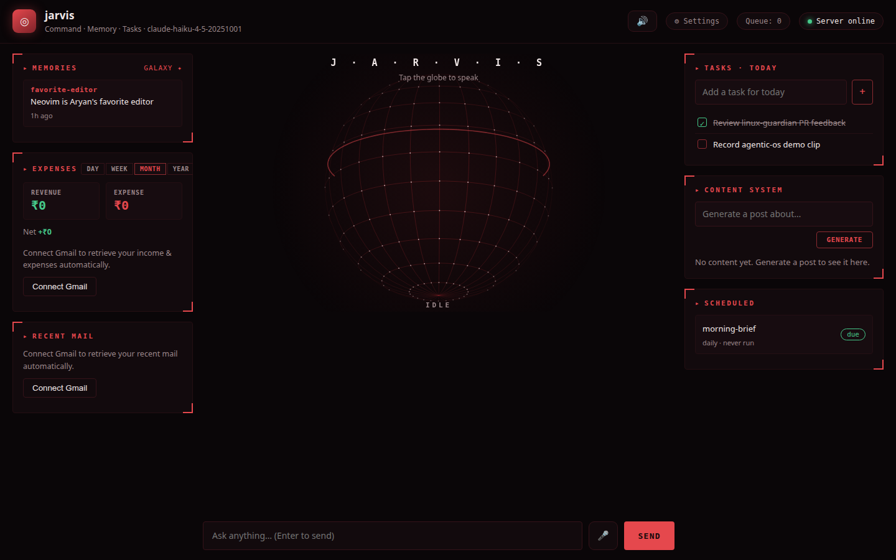

# agentic-os

A minimal personal **agentic operating system** built from scratch in Python —
no agent frameworks, no orchestration libraries. Just the five layers every
agentic OS is made of, each in one readable file:

| Layer | File | What it does |
|---|---|---|
| **Intelligence** | `agentic_os/llm.py` | Claude via the official Anthropic SDK (adaptive thinking, prompt caching, streaming) |
| **Memory** | `agentic_os/memory.py` | Persistent SQLite memory — the agent `remember`s facts and wakes up with a digest of them in every session |
| **Tools** | `agentic_os/tools.py` | Shell, workspace files, memory, web fetching — with a human approval gate and path confinement |
| **Browser** | `agentic_os/browser.py` | Real browser automation (headless Chromium via Playwright) — navigate, click, type, screenshot |
| **Automation** | `agentic_os/scheduler.py` | Cron-friendly scheduled tasks the agent runs unattended |
| **Interface** | `agentic_os/__main__.py` | Streaming CLI chat REPL |
| **Dashboard** | `agentic_os/web.py` | Local web UI — streaming chat, memory browser, task status, shell-approval dialog (stdlib HTTP, zero extra deps) |

The agent loop itself (`agentic_os/kernel.py`) is a deliberate manual
implementation of the request → tool_use → tool_result cycle, so the entire
control flow of "an agent" fits on one screen.

## Quick start

```bash
pip install -r requirements.txt
cp config.example.yaml config.yaml   # edit name/personality/tasks

export ANTHROPIC_API_KEY=sk-ant-...  # or `ant auth login`
python -m agentic_os --config config.yaml
```

```
jarvis ready. Ctrl-D to exit.

you> remember that I deploy on Fridays only
jarvis> Stored. I'll keep that in mind.

you> what do you know about my deploys?
jarvis> You deploy on Fridays only.
```

Memory persists across sessions — quit, reopen, and the agent still knows.

## Web dashboard

Prefer a browser over the terminal? The same agent, as a local web app:

```bash
python -m agentic_os.web --config config.yaml --port 8321
# open http://127.0.0.1:8321
```



Streaming chat on the left; live panels for stored memories and scheduled-task
status on the right. The shell approval gate becomes an Allow/Deny dialog —
the agent blocks mid-turn until you answer, exactly like the CLI's y/N prompt.
Built on `http.server` + Server-Sent Events: no web framework, no JS build
step, no new dependencies.

Also in the dashboard:

- **The globe** — a rotating wireframe sphere at the center of the command
  deck; tap it to speak. The state readout under it tracks the agent:
  IDLE / LISTENING / THINKING / SPEAKING.
- **Tasks · Today** — a quick add/check-off list, stored as plain JSON in the
  workspace, next to the scheduler's status panel.
- **Voice mode** — tap the globe (or 🎤) and talk to your agent; toggle 🔊 to
  have replies spoken aloud (Web Speech API — Chrome/Edge).
- **Memory galaxy** — a visual map of everything the agent remembers,
  clustered by topic, one canvas and zero chart libraries.
- **Web reading** — the agent has a `fetch_url` tool, so you can paste a link
  and ask about it.
- **Content System** — type a topic, hit Generate, and a one-shot LLM call
  (separate from your chat history) writes a short post and stores it in
  `content.json`. No hashtag spam, just the text.
- **Expenses / Recent Mail** — honest empty-state panels: a "Connect Gmail"
  button, same disconnected state a fresh install would actually be in. Real
  Gmail data is a bigger scope (OAuth) than this project takes on; the UI is
  there when it's wired up.
- **Settings / Queue** — a read-only settings dialog (model, thinking mode,
  workspace path, approval policy) and a queue indicator that reflects
  whether a turn is in flight.

## Browser automation

`fetch_url` reads static pages; the `browser_*` tools drive a real one. The
agent gets a persistent headless Chromium session (lazy-launched on first use)
and interacts through **snapshots** — every action returns the page title,
visible text, and a numbered list of interactive elements, so the model can
say "click [3]" or type into a field and see the result:

```
you> go to news.ycombinator.com and open the top story
jarvis> [browser_goto → snapshot → browser_click [0] → reads the article]
```

Tools: `browser_goto`, `browser_click`, `browser_type` (with optional
Enter-to-submit), `browser_read`, `browser_screenshot` (saved into the
workspace). Setup:

```bash
pip install playwright
playwright install chromium
```

Playwright is optional — everything else works without it, and the tools
return a clear install hint if it's missing.

## Model configuration

Any Claude model works — set `model` and the matching `thinking` mode in
`config.yaml`:

```yaml
model: claude-opus-4-8      # or claude-sonnet-5, claude-haiku-4-5, ...
thinking: adaptive          # adaptive (Opus 4.6+ / Sonnet 5) | extended (older models) | off
effort: high                # only applies with adaptive thinking
# thinking_budget: 4096     # only with thinking: extended
```

`adaptive` lets the model decide when and how deeply to think (recommended on
current models). `extended` is the fixed-budget form older models like Haiku
4.5 require. `off` disables thinking entirely for latency-sensitive setups.

## Scheduled automation

Define tasks in `config.yaml`, then let cron fire a pass:

```cron
*/30 * * * * cd /path/to/agentic-os && python3 -m agentic_os.scheduler --config config.yaml
```

Each pass runs only the tasks that are due (`daily` / `hourly`), logs output to
`<workspace>/logs/<task>.log`, and tracks state in `.scheduler_state.json`.
Missed windows (laptop asleep) simply run on the next pass — no double-runs.

## Safety model

- **Shell approval gate** — interactive chat asks `y/N` before every command;
  unattended scheduled runs get shell access only if `autonomous_shell: true`.
- **Workspace confinement** — file tools resolve paths and reject anything
  that escapes the workspace directory.
- **Failure honesty** — tool errors go back to the model as `is_error` results
  instead of crashing the loop; denied commands are reported as denied.

## Tests

```bash
pytest
```

Fake-client dependency injection — the full tool loop, approval gate, and
path-confinement behavior are tested without a single real API call.

## Design notes

- One YAML config drives everything; code stays generic (same philosophy as
  [linux-guardian](https://github.com/aryan05-singh/linux-guardian)).
- The system prompt is the stable cache prefix: identity + memory digest are
  assembled once per turn and marked with `cache_control` so multi-turn chat
  reuses the cache.
- Parallel tool calls are supported: all results return in a single user
  message, as the API expects.
- `stop_reason` is handled exhaustively: `end_turn`, `tool_use`, `pause_turn`
  (server-side resume), `max_tokens`, and `refusal`.
